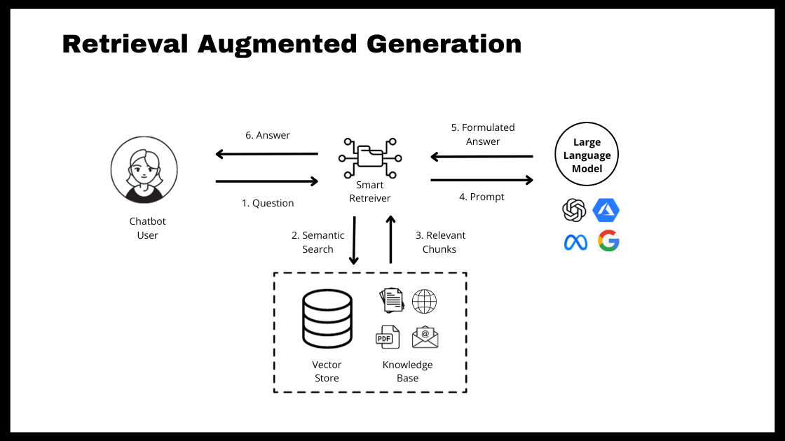

## RAG with langchain and OpenAI

This project demostrate how to implement RAG with langchain.



### Setup

```bash
pip install -r requirements.txt
```


### What is Retrieval-Augmented Generation (RAG)

Retrieval-Augmented Generation (RAG) is an advanced technique that combines the strengths of retrieval-based methods and generation-based models to improve the performance and accuracy of natural language processing tasks. Here's an overview:

#### Advantages

- **Enhanced Contextual Understanding**: By leveraging external information, RAG can provide more accurate and contextually relevant responses.
- **Improved Accuracy**: The retrieval component helps ensure that the generative model has access to the most relevant information, reducing the likelihood of generating incorrect or irrelevant answers.
- **Scalability**: Can handle vast amounts of data, making it suitable for applications like question answering, summarization, and information retrieval.

#### Applications

- **Question Answering**: Provides detailed and accurate answers by retrieving and integrating relevant information.
- **Document Summarization**: Generates summaries that are enriched with contextual information from related documents.
- **Customer Support**: Enhances automated responses by incorporating relevant knowledge base articles.

#### Challenges

- **Computational Complexity**: Combining retrieval and generation can be resource-intensive, requiring efficient implementation to ensure performance.
- **Dependency on Corpus Quality**: The effectiveness of RAG heavily depends on the quality and relevance of the retrieval corpus.
- **Integration Complexity**: Requires seamless integration of retrieval and generation components, which can be technically challenging.

#### Conclusion

RAG represents a significant advancement in NLP by effectively bridging the gap between retrieval-based and generation-based approaches. It harnesses the strengths of both methods to produce responses that are both accurate and contextually rich, making it a valuable technique for various real-world applications.